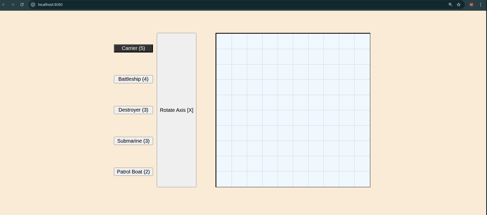
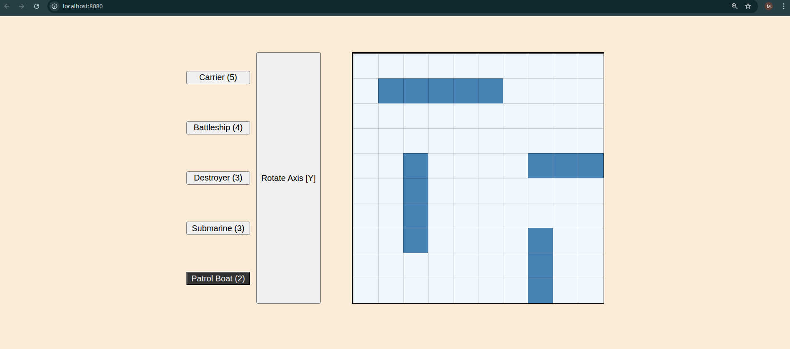
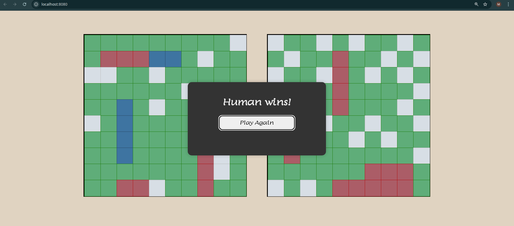

# 📝 Battleship Project:

# 🚢 Battleship
[](https://umersaif11.github.io/battleship/)

## 💻 Tech Stack:

- **Languages:** JavaScript (ES6+), HTML5, CSS3
- **Build Tool:** Webpack (Version 5)
- **Testing:** Jest (with Babel support)
- **Package Manager:** npm
- **Transpiler:** Babel (for ES6+ compatibility)
- **Linter & Formatter:** ESLint, Prettier

---

## 🔍 Key Concepts Demonstrated

### Test-Driven Development (TDD):
The core application logic was built using a "Red-Green-Refactor" workflow. Unit tests were written for factories (`Ship`, `Gameboard`, `Player`) before implementation to ensure robust and bug-free logic.

### Software Architecture (MVC Pattern):
* **Model:** Independent factory functions (`gameboard.js`, `ship.js`, `player.js`) that handle logic and data storage.
* **View:** A dedicated UI module (`dom.js`) that only handles rendering and DOM manipulation.
* **Controller:** A central game controller (`gamecontroller.js` & `index.js`) that acts as the brain, connecting the user input to the game logic.

### Algorithm Design:
* **Smart Computer AI:** Implemented a hunt-and-target algorithm logic (utilizing `do...while` loops) to prevent the computer from shooting the same coordinate twice.
* **Randomized Ship Placement:** A specific algorithm ensures the Computer's fleet is placed randomly at the start of every game, handling edge cases like grid boundaries and overlapping ships.

### State Management:
The application manages distinct phases of the game lifecycle: "Setup Phase" (placing ships), "Game Loop" (turn-based attacking), and "Game Over" (declaring a winner and resetting).

---

## 🎨 Key Features:

- **Interactive Setup Phase:** Click-to-place system allowing players to position their fleet manually.
- **Axis Rotation:** Toggle between horizontal and vertical alignment during placement.
- **Smart Computer Opponent:** The enemy never attacks the same spot twice and randomly places its own ships every game.
- **Visual Feedback:** Color-coded hits (red) and misses (green/water), with immediate UI updates.
- **Game Loop Logic:** Turn-based system that prevents players from moving out of turn or attacking invalid squares.
- **Responsive Grid:** CSS Grid implementation ensuring the boards render perfectly on different screen sizes.
- **Game Over & Restart:** Modal dialog declaring the winner with a seamless "Play Again" reset functionality.

---

## 🗣️ Description

This project is a browser-based implementation of the classic board game Battleship. It was built using Test-Driven Development (TDD) principles to ensure the game logic is decoupled and reliable.

The application separates the DOM manipulation from the game logic entirely. The 'Gameboard' and 'Ship' factories know nothing about the HTML, making the code modular and testable. The UI is dynamically generated based on the state of the game objects. Users play against a computer opponent that makes moves automatically after the user's turn.

---

## ⛰️ Challenges Faced & Lessons Learned

### Application Logic (`gameboard.js` & `gamecontroller.js`):

1) #### Coordinate Validation & Overlaps
One of the hardest logic puzzles was ensuring ships didn't go off the grid or overlap with existing ships. I solved this by implementing a "dry run" validation loop: the code calculates all potential coordinates for a ship *before* placing it. If even one coordinate is invalid (out of bounds or taken), the entire operation returns `false` immediately.

2) #### The "Zombie Ship" Bug
I faced a persistent issue where resetting the game didn't clear the ship states, causing the new game to end immediately. I learned that simply emptying arrays isn't enough; I had to completely re-instantiate the `Player` and `Gameboard` objects to ensure a fresh state (garbage collection) for every new match.

3) #### Random Placement Algorithm
Getting the computer to place ships randomly without crashing required a `while` loop strategy. The code attempts to place a ship at random coordinates; if the `placeShip` method returns false (due to collision), the loop continues until a valid spot is found.

### In the Controller (`index.js`):

1) #### Managing Asynchronous DOM Updates
I initially struggled with the "Game Loop." JavaScript doesn't wait for a user click inside a `while` loop. I realized the game loop isn't a code loop, but a "chain of events." The game state only advances when the `click` event fires, which then triggers the Computer's turn, updates the UI, checks for a winner, and then pauses again.

2) #### Closure & Event Listeners
A tricky bug occurred where the game board wouldn't respond to clicks after a restart. This was because `renderBoard` was creating new DOM elements, but the old event listeners were attached to the deleted elements. I solved this by ensuring event listeners are re-attached to the specific new cells every time the board re-renders.

3) #### Preventing "Double Moves"
To prevent users (or the computer) from wasting turns on already-hit squares, I implemented a validation check inside the attack handler. For the Human, I used CSS `pointer-events: none` on hit squares for a better UX, and for the Computer, I used a `do...while` loop to ensure it generates unique coordinates.

### User Interface (`dom.js`):

1) #### Decoupling the UI
I resisted the urge to put game logic inside the DOM functions. Instead, I used callback functions (`handleAttack`, `handlePlacement`). The DOM module is "dumb"—it just reports *where* a click happened, and the Controller decides *what* that click means (placing a ship vs. attacking).

---

## 🖥️ Screenshots

Setup Phase at very start


Setup Phase while placing ships


MidGame: Human(left) VS Computer(right)


Game Over Modal


---

## 🏃📜 Run This Project Locally

#### 1. Clone Repo

```
git clone git@github.com:umersaif11/battleship.git
```

#### 2. CD into project folder

```
cd battleship
```

#### 3. Install dependencies from package.json

```
npm install
```

#### 4. Jest unit testing

```
npm run test
```

#### 5. Start development server:

```
npm run dev
```

#### 6. Visit local web server in your browser to view:

```
localhost:8080
```
